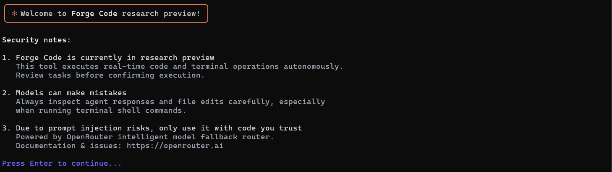

<h1 align="center">FORGE CODE</h1>

  <strong>Autonomous OpenRouter-driven terminal coding agent built with a Claude Code inspired aesthetic.</strong>

  
  
  

<h2>Overview</h2>

  <strong>Forge Code</strong> is a terminal-based autonomous software development agent designed to run globally across any directory on your operating system. It connects directly to OpenRouter's API, giving developers instant access to the latest frontier models without switching tools.

  Built with a minimalist terracotta-accented terminal theme, Forge Code mirrors the streamlined developer workflow of modern AI CLIs: step-by-step reasoning feedback, live token metrics, dynamic model fallback cascades, and autonomous workspace tool calling.

<h2>Key Capabilities</h2>

<ul>
  <li>
    <strong>Dynamic Multi-tier Routing &amp; Fallbacks:</strong>
    <ul>
      <li><code>Auto Free</code>: Dynamically queries OpenRouter's live catalog for active zero-cost coding models. If a free model hits a 429 rate limit or experiences downtime, Forge immediately shifts execution to the next available free model without interrupting the prompt.</li>
      <li><code>Auto</code>: Targets top-performing benchmarked coding models with automatic fallback cascades.</li>
      <li><code>Manual</code>: Provides an interactive real-time fuzzy search across all active models in the OpenRouter catalog.</li>
    </ul>
  </li>
  <li>
    <strong>Workspace Tool Calling:</strong>
    <ul>
      <li>Create, read, update, and delete project files directly in the active execution directory.</li>
      <li>Execute shell commands (e.g., <code>npm test</code>, <code>git status</code>, <code>build</code> scripts) and feed terminal standard output back into the agent context loop.</li>
    </ul>
  </li>
  <li>
    <strong>Telemetry &amp; Session Stats:</strong>
    <ul>
      <li>Real-time per-request prompt and completion token counters.</li>
      <li>Live cumulative token usage tracker for cost and context window management.</li>
    </ul>
  </li>
  <li>
    <strong>Single-Setup Authentication:</strong>
    Securely stores API keys locally using cross-platform configuration storage (<code>Conf</code>), eliminating the need to set keys repeatedly.
  </li>
</ul>

  

<h2>System Architecture</h2>

<pre>
forge-code/
├── bin/
│   └── index.ts                 # CLI entry point (global registration)
├── src/
│   ├── config/
│   │   ├── env.ts               # Environment configurations
│   │   └── key-store.ts         # Persistent local credentials manager (~/.config/forge-code)
│   ├── core/
│   │   ├── agent.ts             # Core recursive loop (Reason -> Call Tool -> Evaluate)
│   │   ├── model-router.ts      # Live pricing inspection & fallback candidate generator
│   │   └── openrouter-client.ts # OpenRouter HTTP/OpenAI wrapper
│   ├── tools/
│   │   ├── index.ts             # LLM function calling declarations & dispatcher
│   │   ├── fs-tools.ts          # File & folder system mutations
│   │   └── terminal-tools.ts    # Shell execution child process runner (execa)
│   ├── ui/
│   │   ├── banner.ts            # Geometric ASCII art & security notes renderer
│   │   ├── prompts.ts           # Interactive real-time search & auth flows
│   │   └── theme.ts             # Terracotta palette, symbols, and ANSI formatters
│   ├── utils/
│   │   └── token-counter.ts     # Fallback token estimator and string formatters
│   └── index.ts                 # Lifecycle initiator
</pre>

<h2>Prerequisites</h2>

<ul>
  <li><strong>Node.js:</strong> Version 18.0.0 or higher (LTS recommended)</li>
  <li><strong>npm:</strong> Version 9.0.0 or higher</li>
  <li><strong>OpenRouter Account:</strong> An API Key obtained from <a href="https://openrouter.ai/keys">openrouter.ai/keys</a></li>
</ul>

<h2>Installation</h2>

<h3>Step 1: Clone the Repository</h3>
<pre><code>git clone https://github.com/dbaidya811/forge-code.git
cd forge-code
npm install
npm run build</code></pre>

<h3>Step 2: Register Global Binary</h3>

<h4>Windows (PowerShell)</h4>
<pre><code>npm install -g .</code></pre>
<blockquote>
  <strong>Path Configuration:</strong> If the <code>forge</code> command is not recognized in a new terminal window, add npm's global prefix to your environment variable:
  <pre><code>$env:Path += ";$((npm config get prefix))"</code></pre>
</blockquote>

<h4>macOS / Linux</h4>
<pre><code>sudo npm install -g .</code></pre>

<h2>Usage</h2>

Run Forge from any project or repository folder on your machine:

<pre><code>forge</code></pre>

<h3>Interactive In-Session Commands</h3>

<table>
  <thead>
    <tr>
      <th>Command</th>
      <th>Description</th>
    </tr>
  </thead>
  <tbody>
    <tr>
      <td><code>/model</code></td>
      <td>Opens the live keystroke search to switch the active model on the fly.</td>
    </tr>
    <tr>
      <td><code>/mode</code></td>
      <td>Toggle execution modes (<code>Auto Free</code>, <code>Auto</code>, <code>Manual</code>).</td>
    </tr>
    <tr>
      <td><code>/clear</code></td>
      <td>Clears the console screen and redraws the Forge header.</td>
    </tr>
    <tr>
      <td><code>exit</code> or <code>/exit</code></td>
      <td>Gracefully terminates the session and outputs total tokens consumed.</td>
    </tr>
  </tbody>
</table>

<h2>Updating the Agent</h2>

To fetch the latest fixes, model routing updates, or tool improvements:

<h4>Windows</h4>
<pre><code>cd path\to\forge-code
git pull
npm install
npm run build
npm install -g .</code></pre>

<h4>macOS / Linux</h4>
<pre><code>cd path/to/forge-code
git pull
npm install
npm run build
sudo npm install -g .</code></pre>

<h2>Developer Guide: Adding Custom Tools</h2>

  Forge Code uses OpenAI-compatible tool specifications. To introduce new capabilities (e.g., Git operations, web scraping):

<ol>
  <li>Add your tool function inside <code>src/tools/</code>.</li>
  <li>Define the JSON schema parameters inside <code>agentToolsDefinitions</code> in <code>src/tools/index.ts</code>.</li>
  <li>Register the executor inside the <code>executeToolCall()</code> dispatcher switch block.</li>
</ol>
